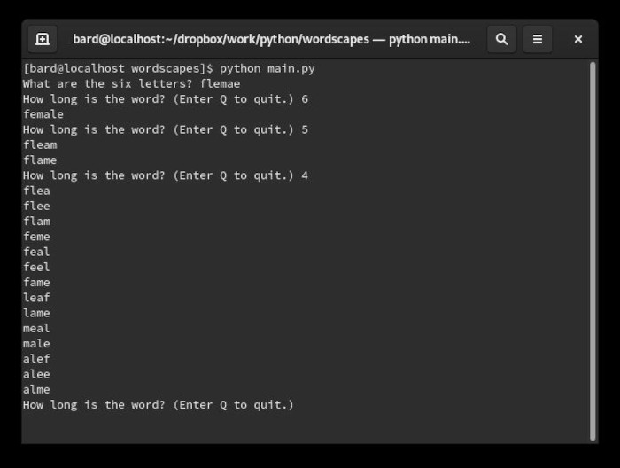

# Wordscapes Solver

This project utilizes Python's itertools module to perform some simple combinatorics operations in an attempt to guess all words needed to beat each level in the game [Wordscapes](https://play.google.com/store/apps/details?id=com.peoplefun.wordcross&hl=en_CA)

Note: Because the [Moby Project](https://en.wikipedia.org/wiki/Moby_Project) contains abbreviations and non-English words not all results will be applicable

## Getting Started

These instructions will get you a copy of the project up and running on your local machine for development and testing purposes.

### Prerequisites

```
Python 3.X, Copyright 2001-2020, Python Software Foundation
```

### Installing

You will need to have Python 3 installed on your machine.

Enter the following line into your command terminal to see which version of Python you have installed. Users of MacOS and Linux most likely already have some version of Python 3 on their machine. If not, please see installation instruction at [python.org](https://docs.python.org/3/).

```
python --version
```



## Built With

* [Sublime-Text](http://www.sublimetext.com/docs/3/) - Development environment

## Authors

* **N.T. Carruthers**  - [GitHub](https://github.com/gif007)

## License

This project is licensed under the MIT License - see the [LICENSE.md](LICENSE.md) file for details